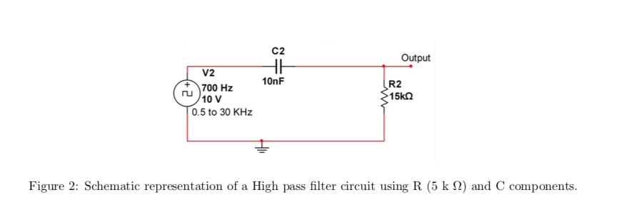
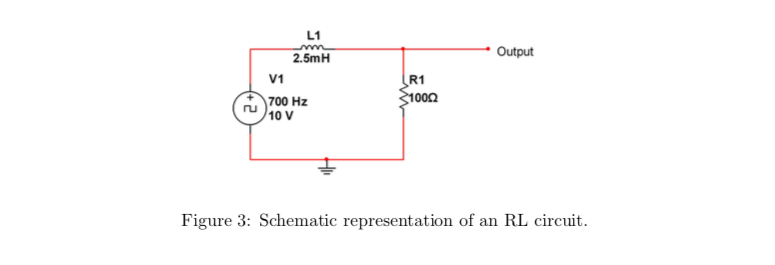
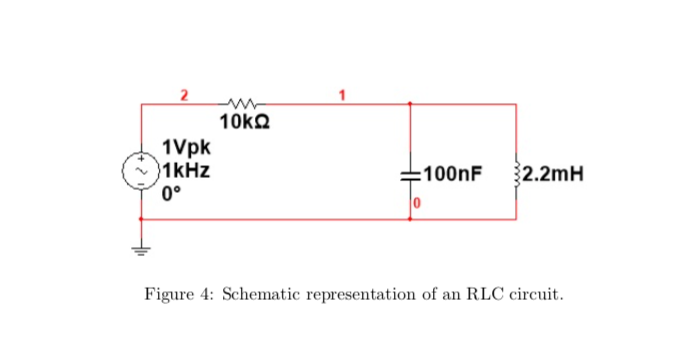

RC and RL Circuits
==================

[Download as PDF](lab3.pdf)

Low pass filter using capacitors
--------------------------------

Construct the low pass filter as shown in Figure 1. Note that the input voltage applied is 10Vp-p.
Calculate the filter’s -3dB frequency point (f3dB). -3dB point is a point where the amplitude drops from by -3dB from the peak. What is the phase shift at different frequencies such as f3dB, 2f3dB, 4f3dB, 10f3dB, and at 0.1f3dB, 0.01f3dB.
Draw Vout/Vin vs Frequency plot in log-log scale in your lab report. Plot also the phase shift with that of Frequency in your lab report.

High pass filter using capacitors
---------
Construct high pass filter as shown in Figure 2. Note that the input voltage applied is 10Vp-p. Calculate the filter’s -3dB frequency point (f3dB). Draw Vout/Vin vs Frequency plot in log-log scale in your lab report. What is the phase shift at different frequencies such as Plot also the phase shift with that of Frequency in your lab report. f3dB, 2f3dB, 4f3dB, 10f3dB, and at 0.1f3dB, 0.01f3dB.

RL circuit
--------
Connect the RL circuit as shown in Figure 3. Provide an input voltage of 10Vp-p at a frequency of 700 Hz. Draw Vout/Vin vs Frequency plot in log-log scale in your lab report for this circuit. Sweep the frequency from 500 Hz to 30 KHz and check f3dB. Change the position of R and L in the circuit and observe the

differance in output with respect to previous positions of R and L. What kind of the filter is RL in previous and updated configuration.

RLC circuit
-----------
Connect the RLC circuit in series as shown in Figure 4. Provide an input of 2 Vp-p. Determine the frequency where the output is very high. This frequency is called resonance frequency of this circuit. Plot the frequency response for this circuit. Remember frequency response suggests Output voltage versus frequency. Now apply a square wave of 2 Vp-p at the resonance frequency and check the output. Slowly decrease the frequency and observe decrease in output voltage. Decrease the frequency till you observe a sudden rise in the output voltage. Again note down the output voltage and input frequency. Repeat this till you find one more rise in the output voltage. Draw a table consisting of three output voltage and three input frequency. Do you see any relation between amplitudes and frequencies ? The peak frequency reduced by 1/3rd, the amplitude reduces close to 1/3rd and similarly the frequency reduced by 1/5th, the amplitude reduces by 1/5th. (The circuit works as a fourier analyzer detecting (1/3rd term) and (1/5th term). You may not appreciate the circuit at this level, but bring it back when you learn Signals and Systems course. This is one of the circuit which had revolutionized signal processing in hardware.

